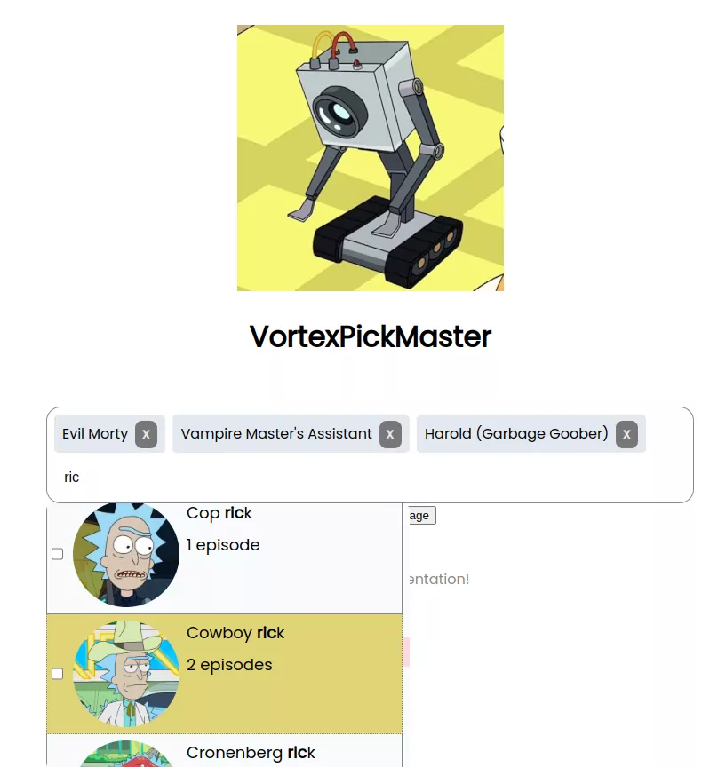

# VortexPickMaster

We've just witnessed the birth of something so galacticbreaking, even my genius intellect is struggling to comprehend it. Brace yourselves, 'cause it's about to get **schwifty**!

Burp Introducing the most revolutionary, mind-bending, and downright interdimensional multiselector component ever created! Yeah, you heard it right. We've got a React multiselector that's so advanced, it makes the Citadel of Ricks look like a daycare center for Jerry's.

I know, I know, you're all probably thinking, "Why should we care, Rick?" Well, you should care because this isn't just any multiselector; this is a tool that transcends dimensions. It's got more versatility than a portal gun on a Friday night bender. Whether you're selecting Mortys from dimension C-137 or Jerrys from dimension J-19ζ7, this bad boy's got you covered.

The UI? Oh, it's sleeker than a spaceship fueled by pure genius. The functionality? Smoother than the delivery of one of my classic one-liners. And the CSS? Well, let's just say it's so stylish, even Mr. Meeseeks would give it a thumbs up.

So, my dear interdimensional travelers, get ready to be blown away by the awesomeness of this React multiselector. It's not just a component; it's a game-changer. If you don't use it, just pop your boobles on tablet.

Don't be a Jerry. Embrace the future. Get schwifty with the multiselector. And remember, in the vast multiverse, there's only one VortexPickMaste .

Now go forth and conquer the coding cosmos, you nerds!

## Technical Stuff

- **React** magically figures out how to render and you dont pay with money
- **Zustand** replica of Unity , you can talk where ever you like
- **Vite** to slap code together, quick and efficient.
